<div align="center">

```
  __  __
 |  \/  |_   _ _ __ ___ ___  ___
 | |\/| | | | | '__/ __/ _ \/ __|
 | |  | | |_| | | | (_|  __/\__ \
 |_|  |_|\__,_|_|  \___\___||___/
    Minecraft Server Manager v1.0.0
```

# MurCes

**A high-performance, zero-overhead TUI & CLI manager for dedicated Minecraft servers on Linux.**

[](https://github.com/DeployedReject/murces/releases)
[](LICENSE)
[](https://www.graalvm.org/)
[](https://openjdk.org/)
[](https://github.com/DeployedReject/murces)
[](https://github.com/tmux/tmux)

<p align="center">
  <a href="#why-murces">Why MurCes</a> •
  <a href="#visual-tour--features">Visual Tour</a> •
  <a href="#quickstart">Quickstart</a> •
  <a href="#cli-commands">CLI Usage</a> •
  <a href="#hotkeys--navigation">Hotkeys</a> •
  <a href="#terminal-rendering--fonts">Fonts</a> •
  <a href="#decoupled-orchestrator-ipc">Architecture & IPC</a> •
  <a href="#building-from-source">Build</a>
</p>

<br>

<p align="center">
  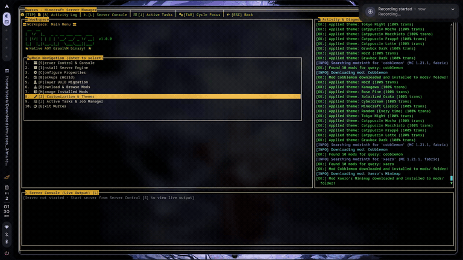
</p>

</div>

---

## Why MurCes?

Managing dedicated Minecraft servers on budget VPS nodes or homelabs often forces an uncomfortable compromise:

- **Heavy Web Panels (Pterodactyl, AMP, MineOS)** require Docker daemons, Node.js runtimes, Nginx reverse proxies, MySQL databases, and background web workers, consuming 500MB to 1.5GB of RAM before your Minecraft server even allocates its heap.
- **Raw Shell Scripts** are brittle, lack visual status monitoring, don't handle dependency resolution, and make tweaking `server.properties` or installing mods a chore.

**MurCes delivers the sweet spot:**

- **Native Ahead-of-Time (AOT) Binary**: Compiled into a standalone ~30MB Linux executable via **GraalVM Native Image**. Launches in **< 20ms** with less than **40MB resident memory** and zero JVM warmup.
- **Detached Process Supervision**: Your server runs inside an isolated, background `tmux` session (`mcsv`). If your SSH connection drops or MurCes exits, the server remains completely unaffected.
- **Modern Terminal Aesthetics**: Designed with 24-bit TrueColor support, background transparency, and popular developer themes (Catppuccin, Nord, Gruvbox, Tokyo Night, Cyberdream, Rose Pine, Kanagawa).
- **Built-in Mod Ecosystem**: Query both **Modrinth** and **CurseForge** directly inside the terminal with loader & version filtering, dependency lookups, and one-key atomic downloads.
- **Safe World State Flushing**: Performs live memory flushing (`save-off` &rarr; `save-all` &rarr; tar archive &rarr; `save-on`) to eliminate backup chunk corruption, with automated retention rotation and optional `rclone` cloud replication.
- **Zero-Config Port Forwarding**: Built-in Playit.gg integration (`-p`) creates secure public tunnels on demand without touching router NAT tables.

---

## Visual Tour & Features

### 1. Main Dashboard & Workspace

> Unified server management cockpit with dual-panel activity diagnostics and live console log stream.

<p align="center">
  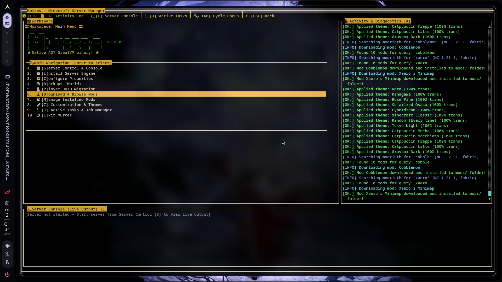
</p>

- **Navigation Hub**: Direct keyboard access to engine installers, mod managers, backups, and configs.
- **Activity & Diagnostics Panel**: Real-time status logs for theme changes, network queries, and download triggers.
- **Embedded Console**: Immediate visibility into the underlying Minecraft server output.

---

### 2. Server Control & Command Dispatch

> Monitor server lifecycle, toggle Playit.gg tunnels, and dispatch in-game commands directly to the tmux session.

<p align="center">
  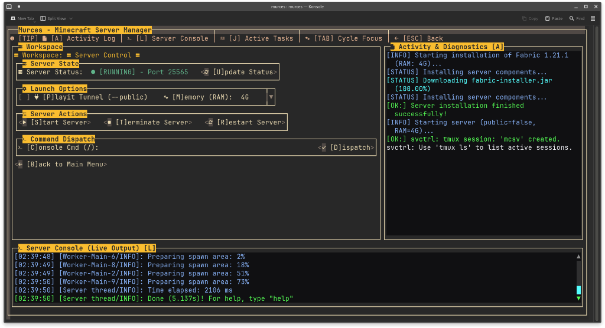
</p>

- **Process Telemetry**: Live status indicator with active port reporting (`[RUNNING] - Port 25565`).
- **One-Click Actions**: Start, restart, or safely terminate the Minecraft daemon with graceful world saves.
- **In-Game Command Prompt**: Dispatch console commands directly into the `mcsv` session without manually attaching tmux.
- **Networking Controls**: Toggle Playit.gg public tunnels and adjust runtime memory allocations on the fly.

---

### 3. Server Engine & Version Setup

> Configure and boot server engines with automatic Mojang EULA acceptance and custom RAM allocation flags.

<p align="center">
  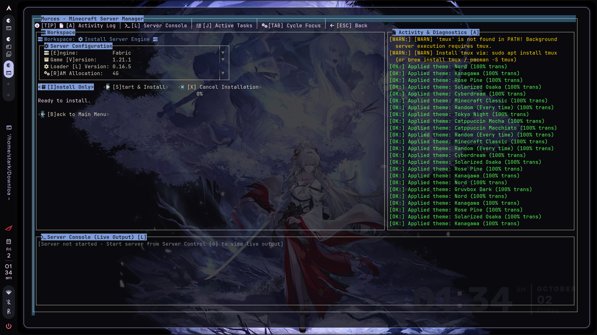
</p>

- **Supported Loaders**: Fabric, Paper, Forge, NeoForge, Spigot, and Vanilla.
- **Dynamic Version Resolver**: Queries live version manifests for both game releases and loader builds.
- **Heap Allocation**: Fine-tune `-Xms` and `-Xmx` RAM allocations without modifying startup shell scripts.

---

### 3. In-TUI Mod Search & Downloader

> Search, inspect, and install mods from Modrinth and CurseForge without leaving your terminal.

<p align="center">
  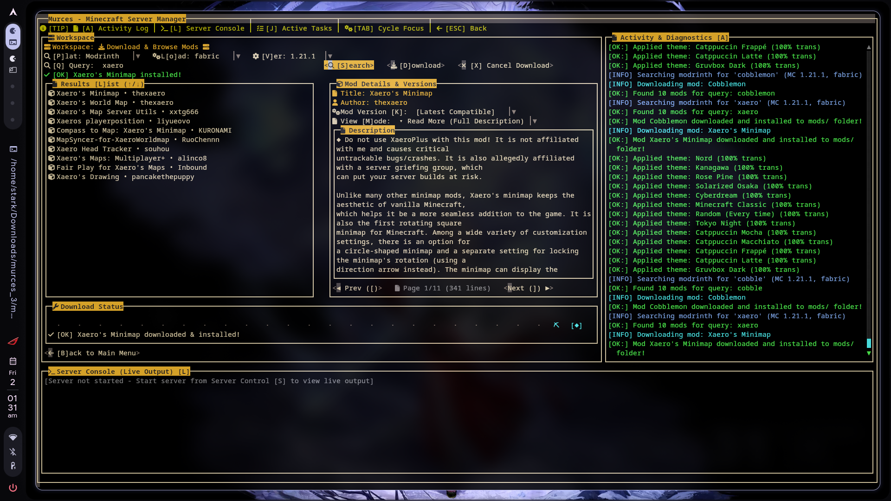
</p>

- **Universal Mod Index**: Switch between Modrinth and CurseForge API providers on the fly.
- **Smart Filtering**: Automatically filters releases by your active server loader (Fabric, Forge, NeoForge, Quilt) and game version.
- **Interactive Inspector**: Read full mod summaries, descriptions, dependencies, and author metadata.
- **Atomic Telemetry**: Real-time progress bar downloads into `.tmp` staging before atomic deployment to `mods/`.

---

### 4. Installed Mods Manager

> Audit and maintain your active server mods directory cleanly.

<p align="center">
  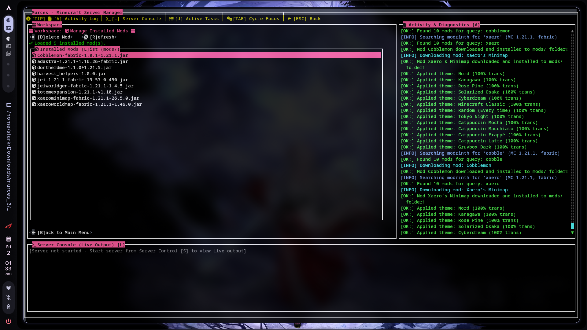
</p>

- Inspect all `.jar` files present in the server's `mods/` directory.
- Instant single-key mod removal (`[D]elete Mod`) with confirmation safety.
- Live file system re-indexing (`[R]efresh`).

---

### 5. Searchable `server.properties` Editor

> Tweak server configuration with a keyboard-driven visual inspector.

<p align="center">
  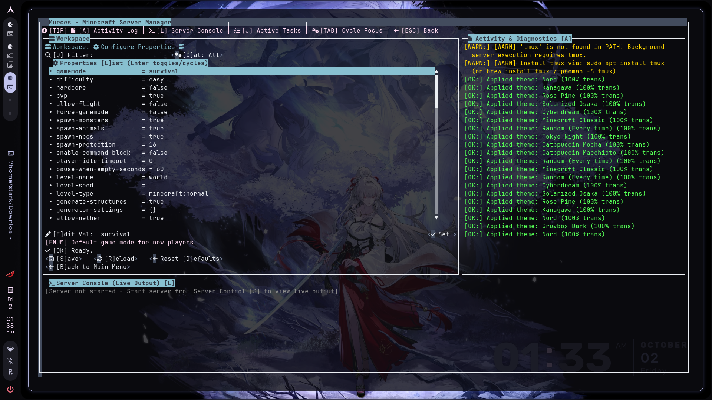
</p>

- **Live Fuzzy Filter**: Press `[Q]` to filter across all available properties instantly.
- **Categorized Sections**: Grouped into Gameplay, World, Network, Security, and Performance.
- **One-Key Enum Cycling**: Press `[Enter]` on boolean or enum flags (`gamemode`, `difficulty`, `pvp`, `spawn-monsters`) to cycle values immediately.
- **Safe Persistence**: Built-in validation with `[S]ave`, `[R]eload`, and `Reset [D]efaults` actions.

---

### 6. World Backups & Live Memory Flushing

> Safe level snapshots that flush memory buffers first to guarantee zero world corruption.

<p align="center">
  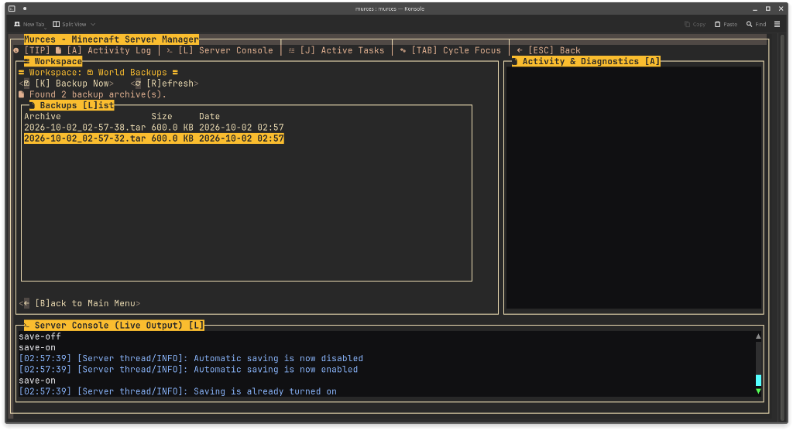
</p>

- **Automated Memory Flushing**: Issues `save-off` and `save-all` to disk before packaging the tarball, re-enabling auto-saving (`save-on`) on exit.
- **Archive Management**: View timestamped `.tar` snapshots with file sizes directly in the TUI.
- **Retention & Cloud Replication**: Automatically retains the latest snapshots and optionally syncs archives offsite via `rclone`.

#### Configuring Google Drive & World Backups

The orchestrator handles automated save flushing, tar archiving, snapshot rotation, and cloud synchronization via `rclone` natively without external scripts.

1. **Install rclone** (for optional cloud sync):

   ```bash
   sudo apt install rclone
   # or: curl https://rclone.org/install.sh | sudo bash
   ```

2. **Configure the Google Drive remote**:
   Run the interactive configuration wizard:

   ```bash
   rclone config
   ```
   - Press `n` for a new remote.
   - Name the remote `minecraftdrive` (or any custom name).
   - Select `drive` for Google Drive.
   - Leave client ID and secret blank for defaults, or provide your own OAuth credentials.
   - Select access scope `1` (full access).
   - Complete browser authentication when prompted.

3. **Verify the connection**:

   ```bash
   rclone lsd minecraftdrive:
   ```

4. **Customize backup settings directly in MurCes TUI**:
   Open **World Backups** (`[B]` from Main Menu) to configure options:
   - **Source World**: Directory to archive (default `world`).
   - **Target Dir**: Folder for `.tar` snapshots (default `backup`).
   - **Retain Count**: Maximum snapshot quota to keep locally (default `3`).
   - **Cloud Sync**: Checkbox toggle to automatically replicate archives via `rclone`.
   - **Remote**: Target rclone remote name (default `minecraftdrive`).
   - Press **`[S]ave Options`** to persist your configuration to `murces.json`.

5. **Trigger a backup**:
   - In the TUI: Press **`[K] Backup Now`** in the World Backups view.
   - Or via MurCes CLI:
     ```bash
     ./murces backup
     ```

---

### 7. Player UUID & Data Migration

> Seamlessly transfer inventories, stats, and advancements between player UUIDs.

<p align="center">
  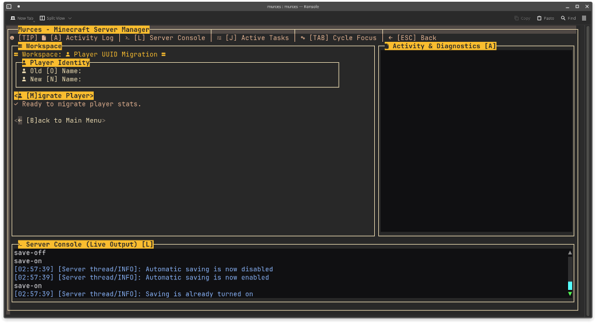
</p>

- **Identity Mapping**: Migrate stats, advancements, and playerdata from an old player name or UUID to a new one.
- **Automatic Backup Safeguard**: Bundles existing playerdata, usercache, stats, and advancements into a safety archive before modifying files.
- **Offline/Online Migration**: Resolve UUID discrepancies caused by switching between offline-mode and Mojang authentication.

---

### 8. Themes, Transparency & Glyphs

> Complete visual customization to match your personal terminal setup.

<p align="center">
  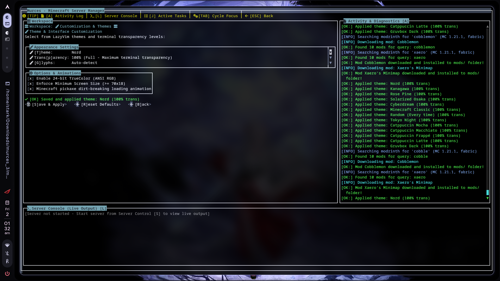
</p>

- **Curated Theme Palettes**: Catppuccin (Mocha, Macchiato, Frappé, Latte), Tokyo Night, Nord, Gruvbox Dark, Rose Pine, Kanagawa, Cyberdream, Solarized Osaka, and Minecraft Classic.
- **Terminal Transparency**: Adjustable from `0%` (solid opaque) to `100%` (full terminal background passthrough).
- **Glyph Engine**: Native Nerd Font icon support with automatic graceful fallback for bare Linux TTYs.
- **Aesthetic Touches**: Optional 24-bit TrueColor rendering and animated pickaxe dirt-breaking loading spinner.

---

### 9. Active Tasks & Job Telemetry

> Monitor asynchronous background operations in real time.

<p align="center">
  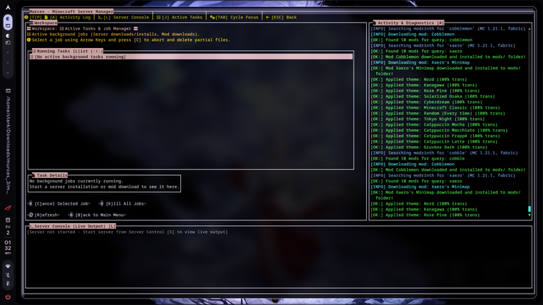
</p>

- Real-time tracking of non-blocking server installations, engine updates, and mod downloads.
- Detailed task telemetry showing active step, bytes transferred, and speed.
- Emergency controls to cancel selected jobs (`[C]`) or terminate all workers (`[K]`).

---

## Quickstart

### 1. One-Line Automated Installer

Run the automated installer to set up all system dependencies (tmux, OpenJDK, curl, tar, rclone, playit) and fetch the latest `murces` standalone executable:

```bash
# Run the automated installer (installs packages and murces executable)
curl -sSL https://raw.githubusercontent.com/DeployedReject/murces/main/install.sh | bash

# Launch the interactive dashboard
./murces
```

Alternatively, to download the precompiled binary directly without the installer:

```bash
curl -sSLO https://github.com/DeployedReject/murces/releases/latest/download/murces
chmod +x murces
./murces
```

> [!NOTE]
> The precompiled native release is completely self-contained in a single executable file. No zip archive extraction or complex configuration is required.

---

## CLI Commands

MurCes functions both as an interactive TUI and as a fast, scriptable CLI tool:

```bash
./murces [command] [options]
```

| Command               | Description                                                             | Flags                                        |
| --------------------- | ----------------------------------------------------------------------- | -------------------------------------------- |
| `./murces`            | Launches the interactive Lanterna TUI dashboard                         | None                                         |
| `./murces start`      | Starts Minecraft in a detached `tmux` session                           | `-p`, `--public` _(starts Playit.gg tunnel)_ |
| `./murces stop`       | Sends graceful `stop` command and terminates the session                | None                                         |
| `./murces status`     | Checks if the Minecraft server daemon is active                         | None                                         |
| `./murces backup`     | Flushes world memory, creates a `.tar` snapshot, and cleans old backups | None                                         |
| `./murces --test-tui` | Runs headless self-test across all TUI screens and exits                | None                                         |
| `./murces --help`     | Displays available command options and syntax                           | None                                         |
| `./murces --version`  | Outputs current release version information                             | None                                         |

---

## Hotkeys & Navigation

| Keybinding              | Action                                                         |
| ----------------------- | -------------------------------------------------------------- |
| `[TAB]` / `[Shift+TAB]` | Cycle focus between Workspace, Activity Log, and Live Console  |
| `[ESC]` / `[B]`         | Return to previous view / Back to Main Menu                    |
| `[A]`                   | Toggle / Jump focus directly to **Activity & Diagnostics Log** |
| `[L]`                   | Toggle / Jump focus directly to **Server Live Console**        |
| `[J]`                   | Open **Active Tasks & Job Manager**                            |
| `[S]`                   | Open **Server Control & Console**                              |
| `[I]`                   | Open **Install Server Engine**                                 |
| `[C]`                   | Open **Configure Properties** (`server.properties`)            |
| `[B]`                   | Open **World Backups**                                         |
| `[P]`                   | Open **Player UUID Migration**                                 |
| `[D]`                   | Open **Download & Browse Mods**                                |
| `[M]`                   | Open **Manage Installed Mods**                                 |
| `[Z]`                   | Open **Customization & Themes**                                |
| `[E]`                   | Exit MurCes                                                    |

---

## System Requirements

| Component                       | Requirement                                     | Details                                                           |
| ------------------------------- | ----------------------------------------------- | ----------------------------------------------------------------- |
| **Operating System**            | Linux 64-bit (x86_64)                           | Tested on Ubuntu, Debian, Arch Linux, Alpine, Fedora, and WSL2    |
| **Terminal Multiplexer**        | `tmux`                                          | Required for detached background session supervision              |
| **HTTP Downloader**             | `curl` or `wget`                                | Required for dependency and package fetching                      |
| **Terminal Font**               | [Nerd Font](https://www.nerdfonts.com/) (v3.0+) | Required for icons, navigation glyphs, and status indicators      |
| **Cloud Sync** _(Optional)_     | `rclone`                                        | Required only if using Google Drive/S3 offsite world backups      |
| **Public Tunnels** _(Optional)_ | `playit`                                        | Required only if running public servers without port forwarding   |
| **Runtime Environment**         | _None_                                          | The native binary runs out of the box with zero Java dependencies |

---

## Terminal Rendering & Fonts

MurCes features rich icons and glyphs powered by [Nerd Fonts](https://www.nerdfonts.com/).

### Automatic Fallback (Zero Setup Needed)

> **You do not need a Nerd Font to use MurCes.**

If you are connected from a basic terminal emulator, standard Linux virtual console (`/dev/tty*`), or an SSH client without patched font glyphs:

1. MurCes automatically detects terminal capabilities at startup.
2. It seamlessly downgrades all UI icons to clean, standard ASCII / Unicode glyphs.
3. No missing glyph boxes (``), character overflow, or corrupted line wraps.

### Manual Overrides

- **In-App**: Press `[Z] Customization & Themes` &rarr; toggle `[G]lyphs` between `Auto-detect`, `Force Nerd Fonts`, or `Basic (Fallback)`.
- **Environment Variables**:
  ```bash
  NO_NERD_FONT=1 ./murces      # Force basic ASCII fallback
  FORCE_NERD_FONT=1 ./murces   # Force full Nerd Font icons
  ```

### Installing Nerd Fonts with `getnf`

If you want the full icon experience, install any patched Nerd Font in seconds:

```bash
# Install getnf
curl -fsSL https://raw.githubusercontent.com/getnf/getnf/main/install.sh | bash

# Browse and install your preferred font (e.g. JetBrains Mono, Fira Code, Hack)
getnf
```

---

## Decoupled Orchestrator (IPC)

MurCes is architected around a decoupled backend engine: **`murces-orchestrator`**.

The orchestrator communicates over standard I/O (`stdin`/`stdout`) via structured JSON IPC messages. This allows you to embed MurCes into custom Discord bots, custom web frontends, CLI automation scripts, or remote administration sidecars.

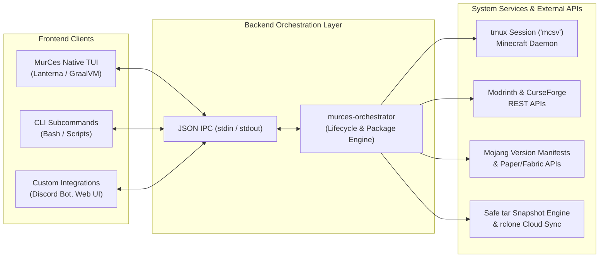

### IPC Examples

#### Bash / Shell

Pipe JSON payloads straight into standard input:

```bash
# 1. Query supported server engines
echo '{"type": "server", "serverType": "none", "gameVersion": "none", "loaderVersion": "none", "ram": 0, "job": 3}' | java -jar murces-orchestrator-1.0.jar

# 2. Download and boot Paper 1.20.4 with 4GB RAM
echo '{"type": "server", "serverType": "paper", "gameVersion": "1.20.4", "loaderVersion": "none", "ram": 4, "job": 1}' | java -jar murces-orchestrator-1.0.jar

# 3. Search Modrinth for "sodium" on Fabric 1.20.4
echo '{"type": "modding", "modBrowser": "modrinth", "subType": "search", "modName": "sodium", "version": "1.20.4", "modLoader": "fabric", "modId": "0"}' | java -jar murces-orchestrator-1.0.jar
```

#### Python Integration (Bots or Web Backends)

```python
import subprocess
import json

proc = subprocess.Popen(
    ["java", "-jar", "murces-orchestrator-1.0.jar"],
    stdin=subprocess.PIPE,
    stdout=subprocess.PIPE,
    text=True,
    bufsize=1
)

def send_ipc(payload):
    proc.stdin.write(json.dumps(payload) + "\n")
    proc.stdin.flush()
    return json.loads(proc.stdout.readline())

# Query live server running state
response = send_ipc({
    "type": "server",
    "serverType": "none",
    "gameVersion": "none",
    "loaderVersion": "none",
    "ram": 0,
    "job": 4
})

print(f"Server Active: {response.get('running')}")
```

> [!TIP]
> For detailed IPC payload schemas, job IDs, and response formats, refer to the full specification in [`doc/API-SPEC.md`](doc/API-SPEC.md).

---

## Building from Source

If you prefer to compile MurCes from source rather than using the official native release:

### Prerequisites

- JDK 21+
- Apache Maven 3.9+
- GraalVM Native Image (`native-image` toolchain installed)

### 1. Compile the Orchestrator

```bash
cd java/orchestrator
mvn clean install
cd ../..
```

### 2. Build the Java TUI (JAR)

```bash
cd java/tui
mvn clean package
# Artifact generated at java/tui/target/murces-tui-0.1.jar
cd ../..
```

### 3. Compile Standalone Native Binary (GraalVM)

```bash
cd java/tui
mvn clean package -Pnative
cp target/murces ../../
cd ../..
```

---

## Configuration & API Keys

- **Release Binaries**: Precompiled releases (`murces.zip`) have the CurseForge API client credentials pre-configured and baked in. Mod browsing works out of the box with zero configuration required.
- **Source Builds & Custom Keys**: If you are compiling from source or wish to provide your own developer credentials, create a `.env` file in the root directory:

```ini
curseAPI="YOUR_CURSEFORGE_API_KEY"
email="your_developer_email@example.com"
```

---

## Branches

- **`main`**: Active production branch containing the Lanterna TUI, decoupled orchestrator backend, and GraalVM build configuration.
- **`archived`**: Historical C prototype and initial proof-of-concept codebase preserved for reference.

---

## Contributing & Community

Contributions, bug reports, and feature proposals are warmly welcome!

- Found a bug? Open an issue on the [GitHub Issue Tracker](https://github.com/DeployedReject/murces/issues).
- Want to contribute code? Fork the repository, create a topic branch, and submit a Pull Request.

---

## License

MurCes is free and open-source software licensed under the **[GNU General Public License v3.0](LICENSE)**.
